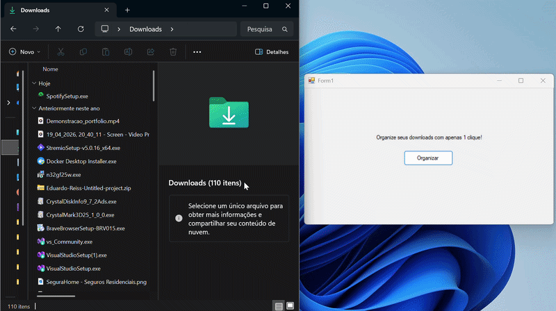

# 📂 Organizador Automático de Downloads

Um utilitário de desktop simples e rápido feito em C# para resolver uma dor que todo mundo tem: a bagunça generalizada na pasta de Downloads do computador. 

Em vez de ficar movendo arquivo por arquivo manualmente, esse programa varre a pasta, identifica o tipo de arquivo pela extensão e joga cada um na sua respectiva pasta (Imagens, Documentos, Executáveis, etc.).

## 🚀 Como funciona?
O programa foi construído usando **Windows Forms** e roda direto no Windows. 

Ele é **100% dinâmico**: não importa o nome do usuário no computador, o código descobre o caminho correto da pasta de Downloads usando variáveis de ambiente do sistema (`Environment.SpecialFolder`), cria as pastas organizadoras caso elas não existam e move os arquivos de forma segura.

### Categorias de organização:
* **Documentos:** `.pdf`, `.docx`, `.txt`, `.xlsx`, etc.
* **Imagens:** `.jpg`, `.png`, `.svg`, `.webp`, etc.
* **Vídeos:** `.mp4`, `.mkv`, `.avi`, etc.
* **Músicas:** `.mp3`, `.wav`, `.flac`, etc.
* **Compactados:** `.zip`, `.rar`, `.7z`, etc.
* **Executáveis:** `.exe`, `.msi`, `.bat`, etc.

## 🛠️ Tecnologias utilizadas
* **Linguagem:** C#
* **Framework:** .NET 8 (Windows Forms)
* **Manipulação de Sistema de Arquivos:** `System.IO` (Classes `File`, `Directory` e `Path`)

## 💻 Como rodar o projeto
1. Clone este repositório no seu computador.
2. Abra o arquivo `.sln` no Visual Studio.
3. Clique em **Iniciar (Play)** para rodar o projeto.
4. Se quiser usar o programa no dia a dia sem abrir o Visual Studio, basta ir na pasta `bin/Debug` do projeto e pegar o arquivo `.exe`.

## 🧠 Aprendizados
Este projeto foi excelente para colocar a mão na massa e praticar fundamentos de lógica fora do ambiente web padrão (ASP.NET), lidando diretamente com:
* Laços de repetição (`foreach`) e estruturas de decisão (`switch-case`).
* Interação direta com o Sistema Operacional através de código.
* Manipulação e concatenação segura de caminhos de arquivos (`Path.Combine`).
